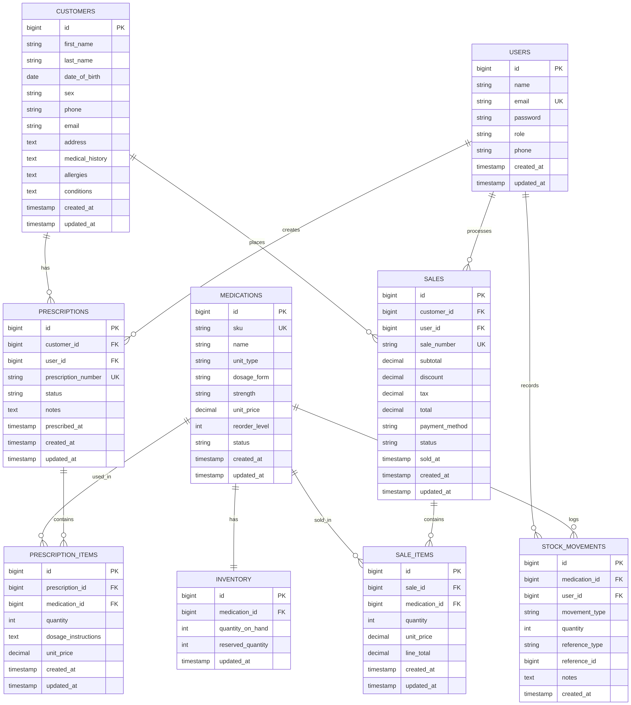
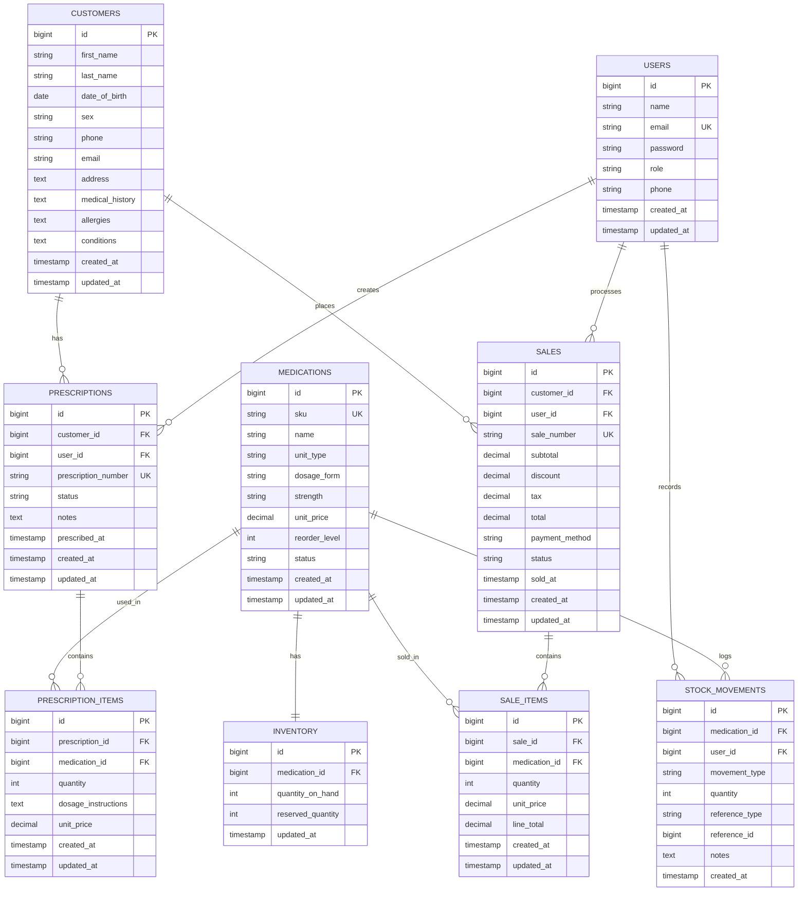
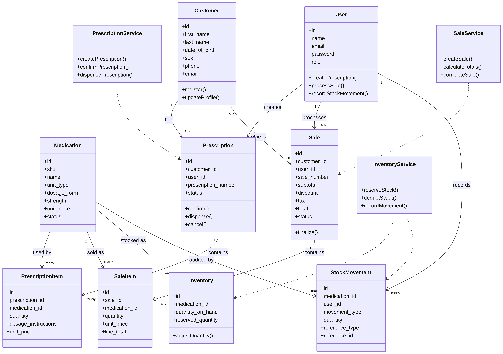
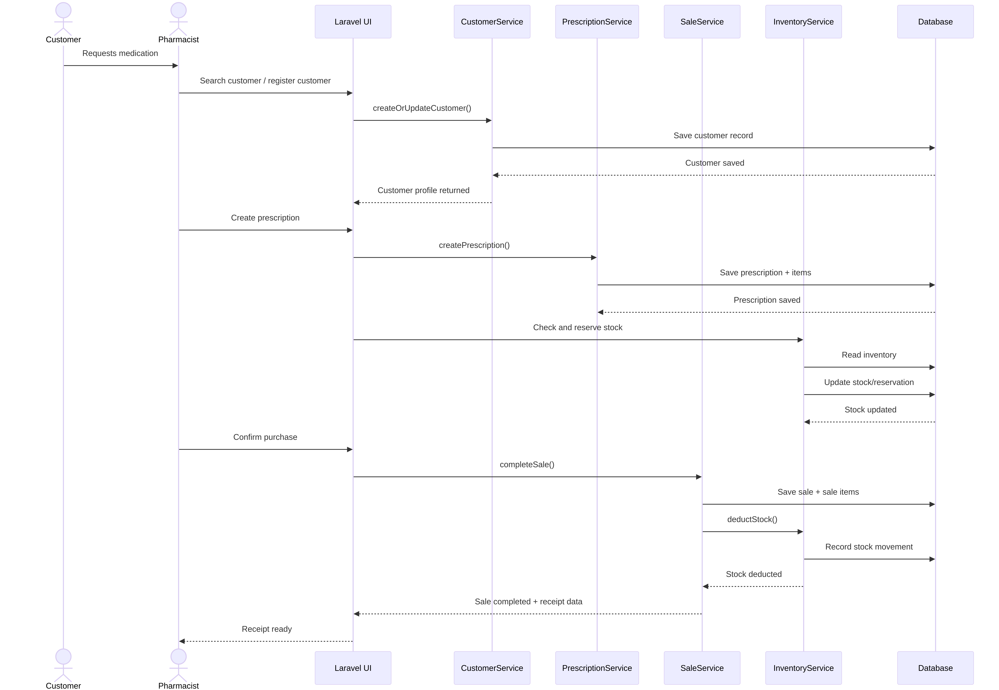
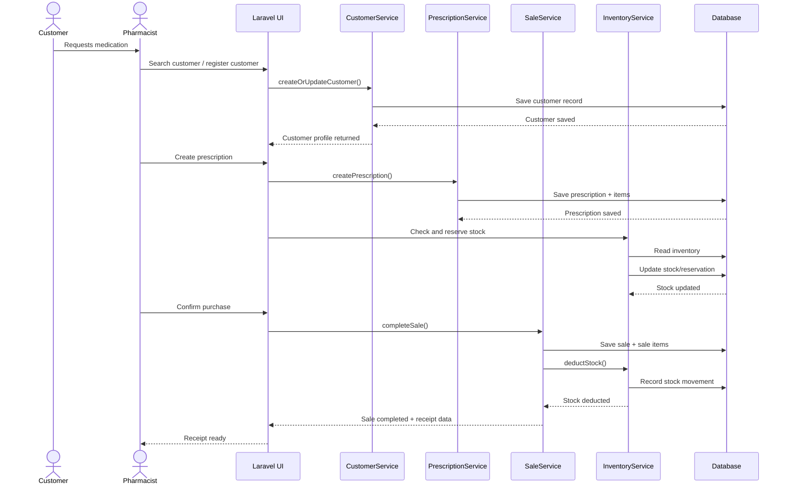
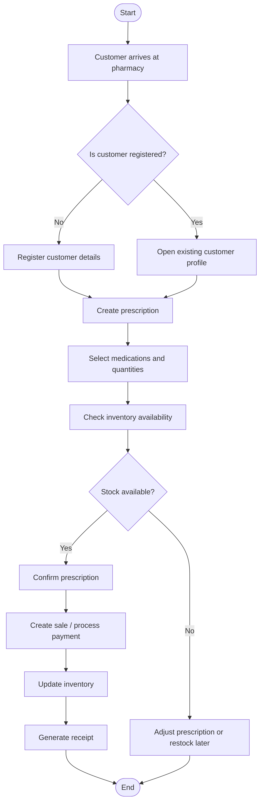
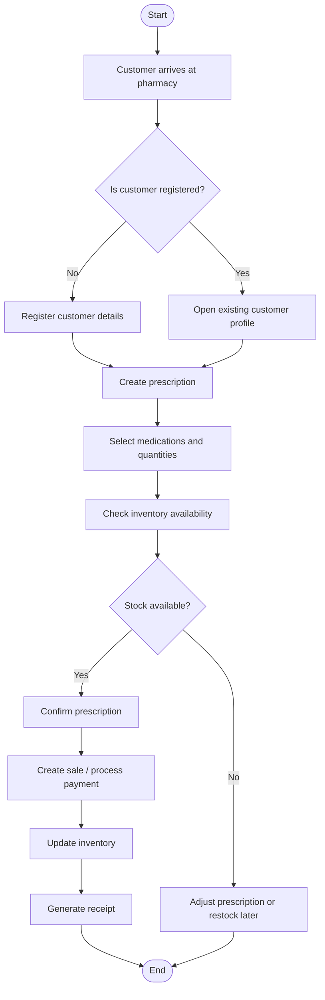

# Application Models Overview

This document describes the main structural and behavioral models for the Aion Pharmacy application. It is meant to help readers understand the system scope before implementation and to provide a shared reference for database design, domain classes, and core workflows.

## 1) Scope and Modeling Notes

The application is a pharmacy management system built with Laravel. At the current scope, the core domain centers on:
- users and roles (admin, pharmacist)
- customers and patient details
- medications and stock
- prescriptions and prescription items
- sales and sale items
- stock movement history for auditing

Modeling notes:
- `users` stores staff accounts; role can be represented as a field on the user record or via a roles system if the app expands.
- `stock_movements` is recommended as the audit trail for inventory changes.
- Current stock can be stored in `inventory` or derived from movements, depending on the implementation strategy.
- The diagrams below reflect the current application scope and may evolve as more pharmacy features are added.
- Prescriptions are treated as part of the sales workflow, not as a separate stock-out event.

---

## 2) ERD - Entity Relationship Model

### 2.1 Textual ERD Specification

Using standard database modeling notation:
- **PK** = Primary Key
- **FK** = Foreign Key
- **UQ** = Unique
- **NN** = Not Null
- **NULL** = Optional / nullable

#### `users`
Staff accounts for the system.
- `id` (PK)
- `name` (NN)
- `email` (UQ, NN)
- `password` (NN)
- `role` (NN) — e.g. `admin`, `pharmacist`
- `phone` (NULL)
- `created_at`, `updated_at`

#### `customers`
Customer/patient records.
- `id` (PK)
- `first_name` (NN)
- `last_name` (NN)
- `date_of_birth` (NN)
- `sex` (NN)
- `phone` (NULL)
- `email` (NULL)
- `address` (NULL)
- `medical_history` (NULL)
- `allergies` (NULL)
- `conditions` (NULL)
- `created_at`, `updated_at`

#### `medications`
Catalog of medicines available in the pharmacy.
- `id` (PK)
- `sku` (UQ, NN)
- `name` (NN)
- `unit_type` (NN) — e.g. `tablet`, `capsule`, `g`, `ml`, `bottle`
- `dosage_form` (NULL)
- `strength` (NULL)
- `unit_price` (NN) — price per single measurable unit
- `reorder_level` (NULL)
- `status` (NN)
- `created_at`, `updated_at`

#### `inventory`
Current stock snapshot for a medication.
- `id` (PK)
- `medication_id` (FK -> medications.id, UQ, NN)
- `quantity_on_hand` (NN)
- `reserved_quantity` (NN, default 0)
- `updated_at`

#### `stock_movements`
Audit trail for all stock changes.
- `id` (PK)
- `medication_id` (FK -> medications.id, NN)
- `user_id` (FK -> users.id, NN)
- `movement_type` (NN) — e.g. `in`, `out`, `adjustment`
- `quantity` (NN)
- `reference_type` (NN) — e.g. `sale`, `manual`, `adjustment`
- `reference_id` (NULL)
- `notes` (NULL)
- `created_at`

#### `prescriptions`
Clinical/dispensing record created for a customer.
- `id` (PK)
- `customer_id` (FK -> customers.id, NN)
- `user_id` (FK -> users.id, NN) — pharmacist who created it
- `prescription_number` (UQ, NN)
- `status` (NN) — e.g. `draft`, `confirmed`, `dispensed`, `cancelled`
- `notes` (NULL)
- `prescribed_at` (NULL)
- `created_at`, `updated_at`

#### `prescription_items`
Line items attached to a prescription.
- `id` (PK)
- `prescription_id` (FK -> prescriptions.id, NN)
- `medication_id` (FK -> medications.id, NN)
- `quantity` (NN)
- `dosage_instructions` (NULL)
- `unit_price` (NN)
- `created_at`, `updated_at`

#### `sales`
Completed point-of-sale transaction.
- `id` (PK)
- `customer_id` (FK -> customers.id, NULL)
- `user_id` (FK -> users.id, NN) — cashier/pharmacist who processed sale
- `sale_number` (UQ, NN)
- `subtotal` (NN)
- `discount` (NN, default 0)
- `tax` (NN, default 0)
- `total` (NN)
- `payment_method` (NN)
- `status` (NN) — e.g. `pending`, `paid`, `void`
- `sold_at` (NULL)
- `created_at`, `updated_at`

#### `sale_items`
Line items attached to a sale.
- `id` (PK)
- `sale_id` (FK -> sales.id, NN)
- `medication_id` (FK -> medications.id, NN)
- `quantity` (NN)
- `unit_price` (NN)
- `line_total` (NN)
- `created_at`, `updated_at`

### 2.2 Relationship Summary

- One `user` can create many `prescriptions`
- One `customer` can have many `prescriptions`
- One `prescription` has many `prescription_items`
- One `medication` can appear in many `prescription_items`
- One `user` can process many `sales`
- One `customer` can be linked to many `sales` (optional)
- One `sale` has many `sale_items`
- One `medication` can appear in many `sale_items`
- One `medication` has one `inventory` record
- One `medication` has many `stock_movements`
- One `user` creates many `stock_movements`
- `stock_movements.reference_type` should usually point to `sale`, `manual`, or `adjustment` only; prescription details belong inside the sale/prescription workflow, not as a separate stock-out event.

### 2.3 Mermaid ER Diagram

---

## 3) Class Diagram

### 3.1 Textual Class Model

The class layer maps the business domain into Laravel models and application services.

#### Core models
- `User` — staff authentication and role-based access
- `Customer` — customer/patient profile
- `Medication` — product catalog entry
- `Inventory` — current stock record for each medication
- `StockMovement` — inventory audit log
- `Prescription` — dispensing request/clinical record
- `PrescriptionItem` — medication lines on a prescription
- `Sale` — completed transaction
- `SaleItem` — item lines on a sale

#### Suggested services
- `CustomerService` — customer registration and update rules
- `PrescriptionService` — create, confirm, and dispense prescriptions
- `SaleService` — complete sale totals and persist sale lines
- `InventoryService` — adjust stock and record movements
- `ReceiptService` — prepare printable receipt data

### 3.2 Mermaid Class Diagram

```mermaid
classDiagram
    class User {
        +id
        +name
        +email
        +password
        +role
        +createPrescription()
        +processSale()
        +recordStockMovement()
    }

    class Customer {
        +id
        +first_name
        +last_name
        +date_of_birth
        +sex
        +phone
        +email
        +register()
        +updateProfile()
    }

    class Medication {
        +id
        +sku
        +name
        +unit_type
        +dosage_form
        +strength
        +unit_price
        +status
    }

    class Inventory {
        +id
        +medication_id
        +quantity_on_hand
        +reserved_quantity
        +adjustQuantity()
    }

    class StockMovement {
        +id
        +medication_id
        +user_id
        +movement_type
        +quantity
        +reference_type
        +reference_id
    }

    class Prescription {
        +id
        +customer_id
        +user_id
        +prescription_number
        +status
        +confirm()
        +dispense()
        +cancel()
    }

    class PrescriptionItem {
        +id
        +prescription_id
        +medication_id
        +quantity
        +dosage_instructions
        +unit_price
    }

    class Sale {
        +id
        +customer_id
        +user_id
        +sale_number
        +subtotal
        +discount
        +tax
        +total
        +status
        +finalize()
    }

    class SaleItem {
        +id
        +sale_id
        +medication_id
        +quantity
        +unit_price
        +line_total
    }

    class PrescriptionService {
        +createPrescription()
        +confirmPrescription()
        +dispensePrescription()
    }

    class SaleService {
        +createSale()
        +calculateTotals()
        +completeSale()
    }

    class InventoryService {
        +reserveStock()
        +deductStock()
        +recordMovement()
    }

    User "1" --> "many" Prescription : creates
    Customer "1" --> "many" Prescription : has
    Prescription "1" --> "many" PrescriptionItem : contains
    Medication "1" --> "many" PrescriptionItem : used by
    User "1" --> "many" Sale : processes
    Customer "0..1" --> "many" Sale : places
    Sale "1" --> "many" SaleItem : contains
    Medication "1" --> "many" SaleItem : sold as
    Medication "1" --> "1" Inventory : stocked as
    Medication "1" --> "many" StockMovement : audited by
    User "1" --> "many" StockMovement : records

    PrescriptionService ..> Prescription
    SaleService ..> Sale
    InventoryService ..> Inventory
    InventoryService ..> StockMovement
```

---

## 4) Sequence Diagram

### 4.1 Behavioral Flow

This sequence represents the typical pharmacy interaction:
1. a customer is identified or registered
2. a pharmacist creates a prescription
3. stock is checked
4. the sale is confirmed
5. inventory is updated
6. a receipt is produced

### 4.2 Mermaid Sequence Diagram

---

## 5) Activity Diagram

### 5.1 Workflow Description

This activity flow shows the end-to-end pharmacy process from customer arrival to completion of sale.

### 5.2 Mermaid Activity Diagram

---

## 6) Modeling Caveats and Evolution Notes

- `admin` and `pharmacist` are modeled as roles on `users` for now.
- If the pharmacy later needs approvals, suppliers, purchasing, or insurance claims, the ERD should expand.
- Keeping `stock_movements` as the source of truth for inventory changes improves traceability.
- The diagrams are intentionally aligned to the current scope and should be updated when new modules are introduced.

